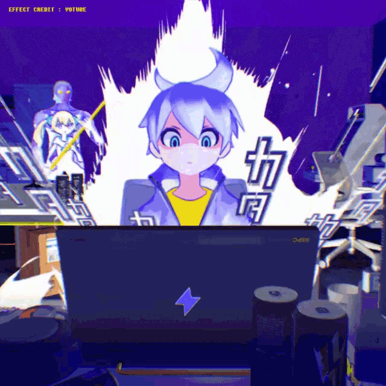
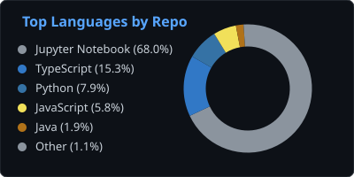
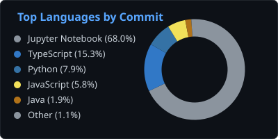

  

<table width="100%">
<tr>

<td width="45%" valign="middle" align="center">

</td>

<td width="55%" valign="middle" align="center">

</td>

</tr>
</table>

<!-- HERO SECTION -->

  <h3><strong>Computer Science Engineering Student | Java Developer | DSA / Problem Solving | Full-Stack Developer | SQL / Database | Machine Learning Enthusiast</strong></h3>
  
<i>Primary: Java + DSA + Problem Solving | Secondary: SQL + Full-Stack Development | Additional: Python + Machine Learning Fundamentals</i>

  

    
    
    
    
    
    
  

  
  

 

<!-- ABOUT & MEDIA SECTION -->
<!-- ================= ABOUT ME ================= -->
<h2 align="center">🚀 About Me</h2>

<table width="100%" border="0">
<tr>
<td width="50%" valign="top" style="border: none; background: none;">

### 👨‍💻 Who am I?

I am a Computer Science Engineering student at Sathyabama Institute of Science and Technology with a strong interest in Java, Data Structures & Algorithms, SQL, full-stack development and machine learning. I enjoy solving programming problems, building practical applications and learning how software systems work from frontend to backend. I am currently focused on strengthening my DSA and software development skills while building real-world projects.

</td>

<td width="50%" align="center" valign="middle" style="border: none; background: none;">

</td>
</tr>
</table>

---

<!-- TECH STACK & ARSENAL -->
<h2>🛠️ Tech Stack & Engineering Arsenal</h2>

<table width="100%" align="center">
<tr>
<td width="50%" valign="top">

<h3>💻 Programming Languages</h3>

 

<h3>🎨 Frontend Development</h3>

 

<h3>⚙️ Backend Development</h3>

 

<h3>🗄️ Databases</h3>

 

<h3>☁️ Tools & Platforms</h3>

</td>
<td width="50%" valign="top">

<h3>🤖 AI / Machine Learning</h3>

Python • PyTorch • Torchvision • Scikit-learn 
Computer Vision • Deep Learning • Transfer Learning 
EfficientNet • OpenCV • Grad-CAM • Explainable AI 
SHAP • Anomaly Detection • Predictive Maintenance 
Demand Forecasting

 

<h3>👨‍💻 Programming Languages</h3>

Java • Python • JavaScript • TypeScript • SQL • HTML • CSS

 

<h3>🌐 Frontend Development</h3>

React • TypeScript • JavaScript • Vite • Tailwind CSS • React Router • Axios

 

<h3>⚙️ Backend Development</h3>

Node.js • Express.js • FastAPI • REST APIs • Spring Boot

 

<h3>🗄️ Databases</h3>

PostgreSQL • MongoDB • SQL • Prisma • Mongoose • SQLAlchemy

 

<h3>🔐 Security & APIs</h3>

JWT • Spring Security • Clerk • Password Hashing • Socket.IO • WebSockets

 

<h3>☁️ Tools & Platforms</h3>

Git • GitHub • Docker • Neon • Stripe • Cloudinary

</td>
</tr>
</table>

---

<!-- PROJECTS -->
<h2>💼 Featured Projects</h2>

<table width="100%">
  <tr>
    <td width="50%" valign="top">
      <h3>🧠 <a href="https://github.com/teja0604/Neuro-Fusion-">NeuroFusionAI</a></h3>
      
An explainable deep-learning medical imaging platform for neurological disease analysis from brain MRI scans, combining deep-learning classification, Grad-CAM explainability, clinical reporting, and a FastAPI backend.

      

        <code>Python</code> <code>PyTorch</code> <code>FastAPI</code> <code>PostgreSQL</code> <code>Grad-CAM</code> <code>OpenCV</code>
      

       
      <a href="https://github.com/teja0604/Neuro-Fusion-">View Project →</a>
    </td>
    <td width="50%" valign="top">
      <h3>🚜 <a href="https://github.com/teja0604/Smart-Rental">Smart Rental</a></h3>
      
Intelligent equipment-rental and fleet analytics platform with real-time telemetry, fleet tracking, predictive maintenance, anomaly detection, demand forecasting, and AI-powered operational insights.

      

        <code>React</code> <code>TypeScript</code> <code>Node.js</code> <code>PostgreSQL</code> <code>Prisma</code> <code>Python</code> <code>FastAPI</code> <code>Socket.IO</code>
      

       
      <a href="https://github.com/teja0604/Smart-Rental">View Project →</a>
    </td>
  </tr>
  <tr>
    <td width="50%" valign="top">
      <h3>🩸 <a href="https://github.com/teja0604/BlooddCare">BloodCare</a></h3>
      
Full-stack healthcare and blood-donation platform supporting donor coordination, blood requests, patient and hospital management, emergency workflows, and role-based healthcare operations.

      

        <code>Java</code> <code>Spring Boot</code> <code>React</code> <code>TypeScript</code> <code>PostgreSQL</code> <code>Spring Security</code> <code>JWT</code>
      

       
      <a href="https://github.com/teja0604/BlooddCare">View Project →</a>
    </td>
    <td width="50%" valign="top">
      <h3>🎙️ <a href="https://github.com/teja0604/Jarvis">JARVIS</a></h3>
      
A browser-based voice assistant built with JavaScript and native Web Speech APIs, supporting voice commands, browser actions, search, and spoken responses.

      

        <code>HTML</code> <code>CSS</code> <code>JavaScript</code> <code>Web Speech API</code>
      

       
      <a href="https://github.com/teja0604/Jarvis">View Project →</a>
    </td>
  </tr>
  <tr>
    <td width="50%" valign="top">
      <h3>🏫 <a href="https://github.com/teja0604/Grievance-Portal">Smart Campus Grievance Portal</a></h3>
      
A secure role-based campus grievance management platform allowing students to submit and track complaints while administrators and staff manage assignment, status updates, and resolution workflows.

      

        <code>React</code> <code>JavaScript</code> <code>Node.js</code> <code>Express</code> <code>PostgreSQL</code> <code>JWT</code>
      

       
      <a href="https://github.com/teja0604/Grievance-Portal">View Project →</a>
    </td>
    <td width="50%" valign="top">
      <h3>🎓 <a href="https://github.com/teja0604/LMS">Learning Management System</a></h3>
      
A full-stack learning platform connecting students and educators through course discovery, enrollment, payments, learning progress tracking, ratings, and educator course management.

      

        <code>React</code> <code>Vite</code> <code>Tailwind CSS</code> <code>Node.js</code> <code>Express</code> <code>MongoDB</code> <code>Clerk</code> <code>Stripe</code> <code>Cloudinary</code>
      

       
      <a href="https://github.com/teja0604/LMS">View Project →</a>
    </td>
  </tr>
</table>

<!-- ENGINEERING EXPERIENCE -->
<h2>🚀 Experience</h2>

<table width="100%">
  <tr>
    <td width="100%" valign="top">
      <h3>🧑‍💻 Technology Intern — Comicode AI Solutions</h3>
      <ul>
        <li>Worked on AI-assisted storybook creation and generated story content.</li>
        <li>Worked with AI-generated images and used Canva for visual content creation.</li>
        <li>Contributed to the Kadhaster platform including character face-swapping functionality.</li>
        <li>Acted as a team lead for fellow interns, managing project deliverables.</li>
      </ul>
       
      <h3>📐 President — Mathematics Club</h3>
      
<strong>Sathyabama Institute of Science and Technology</strong>

      <ul>
        <li>Leadership and coordination of Mathematics Club activities.</li>
      </ul>
       
      <h3>💻 Freelance Project Developer</h3>
      <ul>
        <li>Developed academic and project solutions based on student requirements for final-year students.</li>
        <li>Completed <strong>10+ projects</strong>.</li>
        <li>Focused on delivering functional, practical project implementations across different project requirements and technologies.</li>
      </ul>
    </td>
  </tr>
</table>

## 🏅 Achievements

- 🏆 **Sathyabama Luminary Award for Excellence in Academics and Coding — 2024**
- 🏆 **Sathyabama Luminary Award for Excellence in Academics and Coding — 2025**
- 🥇 **Top 50 — Smart India Hackathon (SIH) 2025**
- 🏆 **9th Place — Sathyabama Start-up**
- 🏆 **7th Place — Caterpillar Hackathon**

<!-- GITHUB ANALYTICS & OPEN SOURCE ACTIVITY -->
<h2>📈 GitHub Analytics & Open Source Activity</h2>

<table align="center" width="100%" border="0">
  <tr>
    <td align="center" width="50%" style="border: none; background: none;">
      
    </td>
    <td align="center" width="50%" style="border: none; background: none;">
      
    </td>
  </tr>
</table>

  

  

<h2>🐍 GitHub Contribution Graph</h2>

  

    
  

---

<!-- CURRENT FOCUS -->
<h2>🧠 Current Focus</h2>

  🔥 Data Structures & Algorithms 🔥 Java 🔥 SQL & DBMS 🔥 Full-Stack Development 🔥 React 🔥 Problem Solving 🌱 Machine Learning 🌱 Building Real-World Projects

 

<!-- ================= COMPETITIVE PROGRAMMING ================= -->
<!-- Section Header with subtle typing or glow effect layout -->
<!-- Section Header with a matching Dark/Glow theme -->

  

<!-- Animated Metrics Section -->

  
  
  
  

<!-- Left/Right Split: Perfectly balanced with working assets -->
<table align="center" width="100%" border="0">
  <tr>
    <td align="center" width="50%" style="border: none; background: none;">
      
    </td>
    <td align="center" width="50%" style="border: none; background: none;">
      <!-- Using a GitHub-native typing animation that never fails to render -->
      
    </td>
  </tr>
</table>

<!-- Animated Footer Divider -->

  

---

